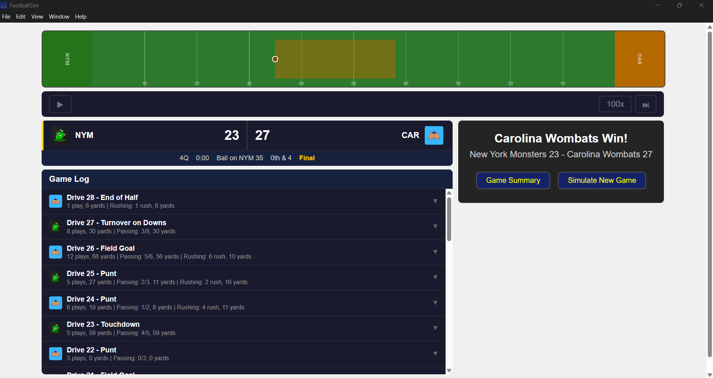

# FBSim Desktop

> A desktop american football simulation user interface built with the FootballSim web components from [fbsim-ui](https://github.com/whatsacomputertho/fbsim-ui)

## Overview

A multi-platform desktop application build with Electron and largely composed of browser-native web components. These components come from the [whatsacomputertho/fbsim-ui](https://github.com/whatsacomputertho/fbsim-ui) repository. They bundle the WASM library built from [whatsacomputertho/fbsim-core](https://github.com/whatsacomputertho/fbsim-core), and alternatively can interact with the FootballSim REST API ([whatsacomputertho/fbsim-api](https://github.com/whatsacomputertho/fbsim-api)) over HTTP.



## Installing

View [the latest release in this repository](https://github.com/whatsacomputertho/fbsim-desktop/releases), it should contain various platform-specific installers and binaries as release assets. Download the installer for your platform, or manually install by downloading its built binary.

## Development

To run the desktop application locally from this repository, run
```sh
make dev
```

This will ensure that all dependencies are installed, and it will build and run the electron application.

Similar `make` recpies exist for building, testing and linting the package, as well as auditing its dependencies.
```sh
make build  # Builds the application for your native platform
make test   # Tests the package
make lint   # Lints the source code and checks formatting
make sec    # Audits the package dependencies
```
